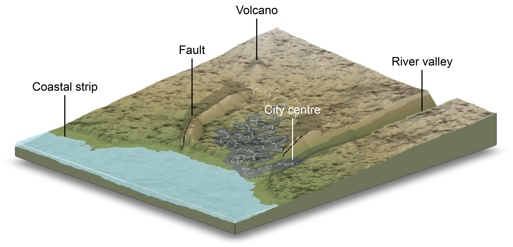

# Introduction to Catastrophe Risk Modelling: A Physics-based Approach

This repository is a clone of the unlocked section of the online resources site [www.cambridge.org/Mignan](https://www.cambridge.org/Mignan) (to be launched in September 2024), associated with the textbook 'Introduction to Catastrophe Risk Modelling: A Physics-based Approach'.

Upon the publication of the book, version 1.0 of the codes will be accessible here. Any future minor updates, not necessarily implemented at [www.cambridge.org/Mignan](https://www.cambridge.org/Mignan), will also be found here.

**Citation:** Mignan, A. (2025), Introduction to Catastrophe Risk Modelling. A Physics-based Approach. Cambridge University Press, doi: 10.1017/9781009437370

## Supplementary material: CAT Risk Modelling Sandbox v1.0 (COMING SOON)

This tutorial acts as a guide to catastrophe (CAT) risk modelling, streamlining the intricate processes typically associated with developing a CAT model while retaining a realistic context. This is achieved by implementing various perils in a virtual environment, as represented in the next figure (Mignan, 2025:fig. 3.10):

  

<small>Instance of the virtual region generated for the CAT Risk Modelling Sandbox, here illustrating the topography and land use layers (the latter consisting of a water mass, built area, and road network) – Simulation rendered with <a target = '_blank' href = 'https://www.rayshader.com'>Rayshader</a> (Morgan-Wall, 2023).</small>

## CAT Starter Kit v1.0 (COMING SOON)

A basic template to develop a catastrophe (CAT) risk model (here with ad-hoc parameters & models). Available in both R and Python.
